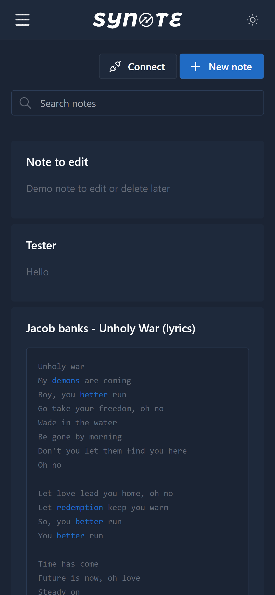
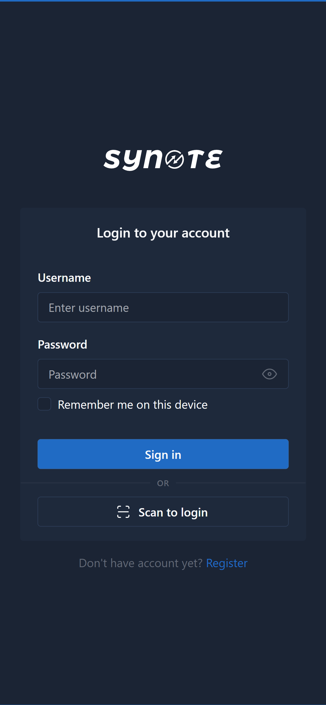

<div id="top"></div>


<!-- ABOUT THE PROJECT -->
## About The Project
Features
* Login / Signup
* Connect device / Scan to login (Like WhatsApp web)
* Add Note
* Edit Note
* Delete Note
* Context Menu on right click / long press (for mobile)
* Card Masonry
* TinyMCE editor

Demo Login :
* Username : dusanstanic
* Password : test

Looking to create different versions of this

The projects includes the Postman API documentation

## Screenshot
<p align="left">


</p>

### Built With
* [PHP](https://php.net/)
* [Bootstrap](https://getbootstrap.com)
* [JQuery](https://jquery.com)

<p align="right">(<a href="#top">back to top</a>)</p>


### Installation

_How to install._

1. Navigate to backend/inc/config.php
2. Edit the credentials
   ```php
   $dbHost = "<DATABASE-HOST>";
   $dbUser = "<DATABASE-USERNAME>";
   $dbPass = "<DATABASE-PASSWORD>";
   $dbName = "<DATABASE-NAME>";
   ```
   
3. Upload drobilica.sql to your database
4. Save and open the url in your browser

<p align="right">(<a href="#top">back to top</a>)</p>
# singidunum-wbis-login-registration
